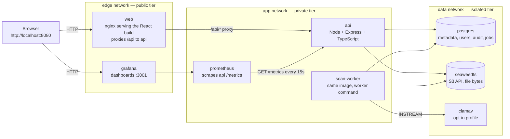
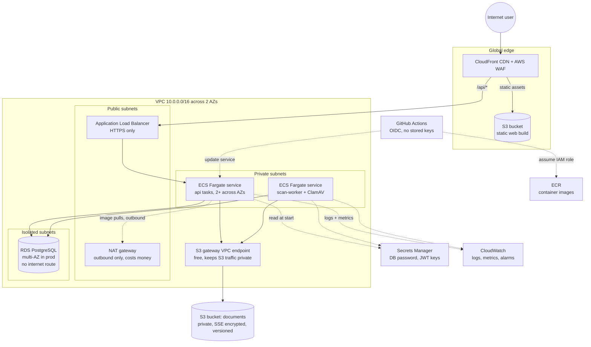
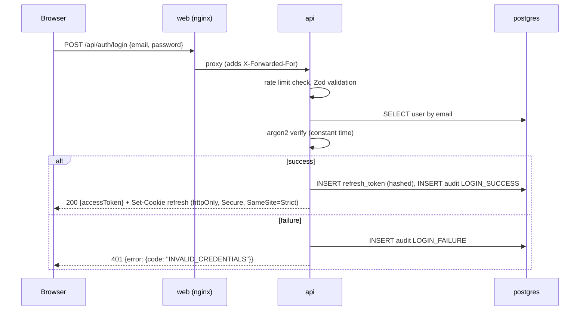
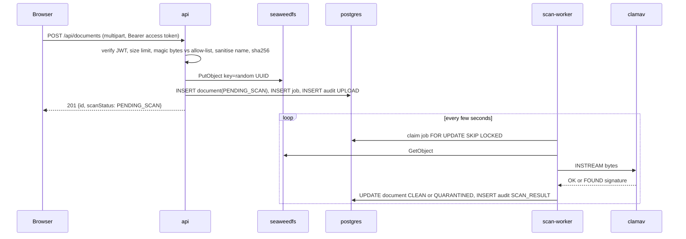
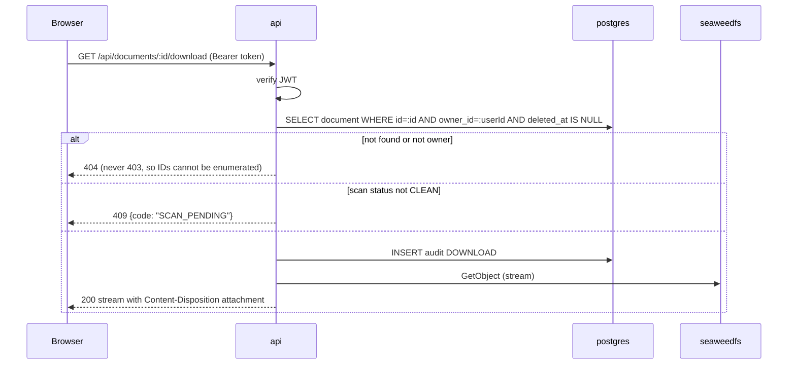
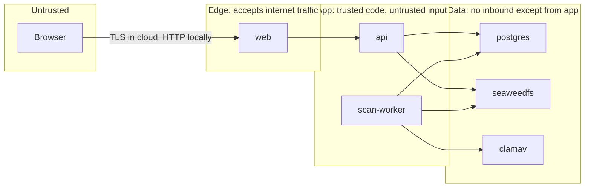

# Architecture

Status labels used in this document (from [PROJECT_SPEC.md](PROJECT_SPEC.md) Section 0.4):

- **RUNS LOCALLY**: implemented and running in Docker on the developer machine
- **TESTED**: covered by automated tests or measured, with real numbers and the machine named
- **SIMULATED**: a local stand-in for a cloud service
- **DESIGNED / NOT DEPLOYED**: exists only as Terraform or documentation
- **NOT IMPLEMENTED**: future work only

As of Phase 1 nothing runs yet. Every component below is DESIGNED until the phase that builds it changes its label in [progress.md](progress.md).

## 1. Design in one paragraph

The system is a three-tier web application designed cloud-agnostically and then mapped to AWS. An edge tier terminates traffic from the internet and serves the static frontend. An application tier runs stateless API containers and a background worker. A data tier holds PostgreSQL for metadata and an S3-compatible object store for file bytes. Each tier is its own network segment, and traffic is only allowed in the direction edge to app to data. Secrets, logs, metrics, backups and deployment automation surround the three tiers. Locally, Docker networks play the role of subnets. In AWS, VPC subnets and security groups play that role.

## 2. Local architecture (Docker Compose)

Membership of each container in the three Docker networks:

| Container | edge | app | data | Published to host |
|---|---|---|---|---|
| web | yes | yes | no | 8080 |
| api | no | yes | yes | 127.0.0.1:3000 (dev and load tests only) |
| scan-worker | no | yes | yes | none |
| postgres | no | no | yes | none by default |
| seaweedfs | no | no | yes | none by default |
| clamav | no | no | yes | none |
| prometheus | no | yes | no | none |
| grafana | yes | yes | no | 3001 |

The rule that matters: **web is not on the data network, so it cannot open a TCP connection to Postgres or SeaweedFS even if it is compromised.** Docker enforces that with separate bridge networks, which is the same idea as putting the database in a subnet that has no route from the public subnet. The switching equivalent is a VLAN with no inter-VLAN route to the database VLAN.

## 3. AWS target architecture

Everything in this diagram is **DESIGNED / NOT DEPLOYED**. It will be written as Terraform in Phase 8 and validated with `terraform validate`, tflint and Trivy, never planned or applied.

## 4. Local component to AWS equivalent

| Local component | Role | AWS equivalent | Status after Phase 1 |
|---|---|---|---|
| Browser on localhost | user | Internet user behind CloudFront + WAF | n/a |
| `web` (nginx + React build) | serves UI, proxies API | S3 static bucket behind CloudFront; ALB path rule for `/api/*` | DESIGNED / NOT DEPLOYED |
| `api` (Express) | REST API | ECS Fargate service behind ALB | DESIGNED / NOT DEPLOYED |
| `scan-worker` | job consumer | second ECS Fargate service | DESIGNED / NOT DEPLOYED |
| Docker networks edge/app/data | segmentation | VPC public/private/isolated subnets + security groups | SIMULATED when built |
| `postgres` container | metadata store | RDS PostgreSQL, multi-AZ in prod | SIMULATED when built |
| `seaweedfs` container | file bytes | S3 private bucket + gateway endpoint | SIMULATED when built |
| `clamav` container | malware scan | ClamAV container on Fargate | SIMULATED when built |
| `.env` file | secrets | Secrets Manager injected into task definitions | SIMULATED when built |
| pino JSON on stdout | logs | CloudWatch Logs via awslogs driver | DESIGNED / NOT DEPLOYED |
| `prometheus` + `grafana` | metrics, dashboards, alerts | CloudWatch metrics, alarms, dashboards (or Amazon Managed Prometheus/Grafana) | DESIGNED / NOT DEPLOYED |
| Postgres job table | queue | same pattern on RDS; SQS is the managed alternative | DESIGNED / NOT DEPLOYED |
| `docker compose build` | image build | GitHub Actions build, push to ECR | DESIGNED / NOT DEPLOYED |
| Backup scripts to local folder | backups | RDS automated backups + snapshots, S3 versioning + lifecycle | DESIGNED / NOT DEPLOYED |

## 5. Components

Each component answers the six questions from Section 15 of the spec: what it is, why it is needed, how it works, why it was chosen, what happens without it, how a real company uses it.

### 5.1 web: nginx serving the React build

- **What**: a small nginx container holding the compiled React + Vite + Tailwind bundle and forwarding `/api/*` to the API container.
- **Why**: browsers need something to serve static files, and a reverse proxy gives the frontend and API one origin, which removes most CORS headaches and mirrors how a CDN plus load balancer path rule works in the cloud.
- **How**: multi-stage Dockerfile. Stage one runs `vite build`. Stage two copies `dist/` into `nginx:alpine` with a config that serves `index.html` for unknown paths (client-side routing) and proxies `/api`.
- **Why chosen**: nginx is the industry default reverse proxy, tiny, and needs no runtime. Serving the UI from the Node process would couple UI scaling to API scaling.
- **Without it**: the Vite dev server would be the only way to see the UI, and there would be no single origin. That works for development, not for a deployable artefact.
- **Real companies**: build once in CI, ship the static bundle to a CDN, and let the CDN or load balancer route API paths to the backend.

### 5.2 api: Node + Express + TypeScript

- **What**: the REST API. Auth, RBAC, document CRUD, uploads, streamed downloads, health, readiness and metrics endpoints.
- **Why**: all business rules and every security check live here. The browser is untrusted; the API is the boundary.
- **How**: Express with middleware layers in a fixed order: request ID, pino logger, helmet, CORS, rate limiter (auth routes), JSON body parser, Zod validation, JWT verification, role check, route handler, error handler that produces one consistent error shape.
- **Why chosen**: Express is minimal and well understood, and TypeScript across front and back lets the Zod schemas in `packages/shared` be reused by both.
- **Without it**: the frontend would talk to the database directly, which is the exact thing that makes the "User A reads User B's file" attack trivial.
- **Real companies**: stateless API containers behind a load balancer, horizontally scaled, with every check server-side.

### 5.3 scan-worker: background job consumer

- **What**: the same API image started with a `worker` command. It loops over a `jobs` table in Postgres, claims one job at a time, streams the file to ClamAV and records the verdict.
- **Why**: malware scanning can take seconds. Doing it inside the upload request would tie up the API and time out browsers. Uploads should return fast with `PENDING_SCAN`.
- **How**: `SELECT ... FOR UPDATE SKIP LOCKED LIMIT 1` inside a transaction so several workers never take the same job. Retries with a back-off counter. Failures after N attempts are marked and audited.
- **Why chosen**: a Postgres job table is the simplest queue that is transactional with the data it protects. Redis would add a container, a network path and a second failure mode on an 8 GB laptop for no gain at this scale.
- **Without it**: uploads would either block on the scan or skip it. Skipping it means the platform can distribute malware.
- **Real companies**: the same shape with SQS or a managed queue and a fleet of workers; the "job table" pattern is common until throughput demands a dedicated broker.

### 5.4 postgres: metadata store

- **What**: PostgreSQL holding users, roles, refresh tokens, document metadata, folders, tags, jobs and the audit log. Never file bytes.
- **Why**: relational integrity (a document belongs to exactly one owner), transactions, and mature tooling. Prisma handles migrations so the schema is versioned in git.
- **How**: reached only over the data network by `api` and `scan-worker`. The application connects as a limited role that has no DELETE or UPDATE on `audit_events`.
- **Why chosen**: PostgreSQL is the default relational database in the cloud (RDS, Aurora, Cloud SQL all offer it) and the local container is byte-for-byte the same engine.
- **Without it**: no ownership model, no audit trail, no way to answer "who downloaded this".
- **Real companies**: managed PostgreSQL in isolated subnets, automated backups, read replicas when reads dominate.

### 5.5 seaweedfs: S3-compatible object storage

- **What**: an Apache-2.0 object store exposing the S3 API. Holds the file bytes under random keys.
- **Why**: files do not belong in a relational database or on a container's disk. Object storage is cheap, durable and scales independently of compute. Using the S3 API locally means the same code path works against real S3 later.
- **How**: the API uses the AWS SDK for JavaScript v3 with a custom endpoint and path-style addressing. Bucket is private; nothing is served to browsers directly.
- **Why chosen**: see [environment.md](environment.md). MinIO's community edition is no longer maintained; SeaweedFS is maintained, light and permissively licensed. Garage is the fallback.
- **Without it**: files on the API container's disk disappear when the container is replaced, and two API replicas would not see each other's files.
- **Real companies**: S3 with public access blocked, server-side encryption, versioning and lifecycle rules, reached from private subnets through a VPC endpoint.

### 5.6 clamav: malware scanner (opt-in)

- **What**: the official ClamAV daemon. The worker streams file bytes to it over the `INSTREAM` protocol on the data network.
- **Why**: a document platform that accepts uploads from anyone is a malware distribution channel unless every file is scanned.
- **How**: Compose profile `scan`. When the profile is off, the worker marks jobs `SCAN_SKIPPED` and documents stay `PENDING_SCAN`, and the docs say so. Nothing pretends a scan happened.
- **Why chosen**: it is the standard open-source scanner and the only serious free option.
- **Without it**: no scanning. The spec allows marking this NOT IMPLEMENTED if the machine cannot run it; the decision is made in Phase 7 with real memory measurements.
- **Real companies**: scan on upload with ClamAV or a commercial engine, quarantine hits, and alert security.

### 5.7 prometheus and grafana: metrics and dashboards

- **What**: Prometheus scrapes `/metrics` from the API every 15 seconds and stores time series. Grafana renders a dashboard provisioned from JSON in the repo and evaluates alert rules.
- **Why**: "is it up" and "is it slow" must be answered from numbers, not from guessing. Request rate, error rate and latency percentiles are the minimum any production service reports.
- **How**: `prom-client` in the API exposes a histogram of request durations labelled by route and status, plus counters for uploads and failed logins. Grafana provisioning files live in `/observability`.
- **Why chosen**: both are open source, run in one small container each, and the concepts (scrape, series, PromQL, p95) transfer directly to CloudWatch and to managed Prometheus offerings.
- **Without it**: the only signal would be the logs, and nobody notices a 5 % error rate by reading logs.
- **Real companies**: exactly this, or the managed equivalents, with alerts routed to on-call.

### 5.8 AWS-only components (DESIGNED / NOT DEPLOYED)

| Component | What it is and why it exists |
|---|---|
| CloudFront + WAF | CDN caches the static site close to users and terminates TLS. WAF blocks common web attacks and rate-limits abusive clients before they reach the load balancer. |
| Application Load Balancer | Spreads requests across API tasks in two AZs, does health checks, and is the only thing in a public subnet that accepts inbound traffic. |
| ECS Fargate | Runs containers without managing servers. Chosen over EC2 (no patching, no capacity planning) and over EKS (Kubernetes adds a control-plane charge and operational weight this project does not need). |
| NAT gateway | Lets private subnets reach the internet outbound (image pulls, OS updates) without being reachable inbound. It is billed per hour and per GB, which is why the S3 gateway endpoint exists: S3 traffic bypasses NAT for free. |
| S3 gateway VPC endpoint | A route-table entry that sends S3 traffic over the AWS backbone instead of the internet. Free, faster, and keeps documents off the public internet. |
| RDS PostgreSQL | Managed Postgres in isolated subnets with no internet route at all. Multi-AZ in prod gives automatic failover. |
| Secrets Manager | Holds the DB password and JWT signing keys. Task definitions reference secrets by ARN; the values never appear in Terraform state, environment files or logs. |
| IAM roles | One task role per service with only the permissions it needs, for example `s3:GetObject`/`PutObject` on one bucket prefix. A separate role that GitHub Actions assumes through OIDC, so no long-lived AWS keys exist anywhere. |
| CloudWatch | Log groups per service with retention limits, metrics, and alarms that map one-to-one to the local Grafana alert rules. |
| ECR | Private container registry that Fargate pulls from. |

## 6. Request flows

### 6.1 Login

### 6.2 Upload and scan

### 6.3 Download (streamed, with ownership check)

**Why streaming instead of pre-signed URLs.** A pre-signed URL offloads bandwidth from the API to the object store and is how large systems scale downloads. But the URL is a bearer credential for its lifetime, the download bypasses the API's audit log unless extra plumbing is added, and locally the browser cannot resolve the storage container's Docker hostname. Streaming keeps every download inside the auth, RBAC and audit path. The cost is that the API becomes the download bottleneck, which is fine at this project's scale. [scalability.md](scalability.md) (Phase 13) documents the pre-signed path as the upgrade.

## 7. Data flow and ownership

- The browser never talks to Postgres or SeaweedFS. Only `api` and `scan-worker` do.
- Every document row carries `owner_id`. Every document query in the API includes `owner_id = current user` in the WHERE clause. Ownership is enforced in the data access layer, not in individual route handlers, so a forgotten check in one route cannot leak data.
- Storage keys are random UUIDs, never derived from the filename or user, so a key cannot be guessed.
- Soft delete sets `deleted_at`. A later job removes the object from storage. Audit rows are never deleted.
- Admin actions on documents (if ever added) go through a separate `/api/admin/documents/:id` route that requires a reason string and writes an `ADMIN_DOCUMENT_ACCESS` audit event. Phase 1 design only.

## 8. Security boundaries

| Boundary | Local enforcement | AWS enforcement |
|---|---|---|
| Internet to edge | only ports 8080 and 3001 published | WAF, ALB security group allows 443 from 0.0.0.0/0 only |
| Edge to app | web and api share the app network | app security group allows the API port from the ALB security group only |
| App to data | api and worker share the data network; web does not | DB security group allows 5432 from the app security group only; S3 bucket policy allows the task role only |
| Data to internet | no published ports | isolated subnets have no route to an internet gateway or NAT |
| Secrets | `.env` git-ignored, `.env.example` committed | Secrets Manager, IAM-scoped, never in state or logs |
| Deploy credentials | none | GitHub OIDC federated role, no stored keys |

Security groups are stateful (return traffic is allowed automatically), like a stateful firewall; network ACLs are stateless, like a router ACL. This project uses security groups for the real rules and leaves NACLs at their permissive defaults, which is common practice. [networking.md](networking.md) (Phase 8) goes deeper.

## 9. Failure scenarios

| Failure | What the user sees | How it is detected | Designed behaviour | Recovery |
|---|---|---|---|---|
| api container down | UI loads, every action fails | Prometheus `up` = 0, Grafana "service down" alert; ALB health check fails in AWS | nginx returns 502 for `/api`; ALB stops routing to the task and ECS replaces it | Compose restart policy; ECS desired count |
| postgres down | login and listing fail | `/ready` returns 503 with `db: false`; alert "DB not ready" | API returns 503 with a consistent error, does not crash, retries connection | restart container; RDS multi-AZ failover in prod |
| seaweedfs down | uploads and downloads fail, metadata still works | `/ready` returns 503 with `storage: false` | upload returns 503; listing still works | restart container; S3 has no single-instance failure mode |
| clamav down or profile off | uploads succeed but stay PENDING_SCAN | job age metric grows; alert on oldest pending job | worker retries with back-off; documents remain undownloadable | start profile; scan backlog drains |
| network cut between api and data | as postgres down | same as above | connection pool errors surface as 503, not 500 | Compose network reattach; AWS: multi-AZ |
| traffic spike | latency rises | p95 alert, rate limiter counters | rate limiting on auth; other routes degrade gracefully | scale API replicas (Compose `--scale`, ECS desired count) |
| expired access token | request rejected | none needed | 401 with `TOKEN_EXPIRED`; frontend silently refreshes once, then logs out | n/a |
| refresh token reuse | user logged out everywhere | audit event `REFRESH_REUSE_DETECTED`; failed-login-spike alert | whole token family revoked | user logs in again |

Each of these will be simulated locally in Phase 12 and the expected-versus-actual results recorded.

## 10. Scaling summary

Stateless API tasks scale horizontally behind the load balancer; no session state lives in the process because refresh tokens are in Postgres and files are in object storage. Postgres scales vertically first, then with a read replica and connection pooling. Object storage and the CDN scale without action. The worker scales by adding consumers because `SKIP LOCKED` prevents double processing. [scalability.md](scalability.md) (Phase 13) walks through 100 to 100,000 users and keeps "DESIGNED FOR" separate from "ACTUALLY TESTED AT".

## 11. Decisions record

| # | Decision | Alternatives | Reason | Date |
|---|---|---|---|---|
| D1 | SeaweedFS for S3-compatible storage; Garage as fallback | MinIO, RustFS | MinIO community unmaintained; RustFS too new; SeaweedFS maintained, Apache 2.0, light | 2026-09-25 |
| D2 | Downloads streamed through the API after an ownership check | pre-signed URLs | keeps auth, RBAC and audit on one path; avoids local hostname problems; pre-signed documented as the scale-up | 2026-09-25 |
| D3 | Postgres job table with SKIP LOCKED as the queue | Redis + BullMQ, SQS | transactional with the data, one fewer container on an 8 GB laptop | 2026-09-25 |
| D4 | ClamAV as an opt-in Compose profile | always on, NOT IMPLEMENTED | 1 to 1.5 GB RAM cost on a 7.9 GB machine; feasibility measured in Phase 7 | 2026-09-25 |
| D5 | checkov runs in GitHub Actions only; Trivy + tflint locally | checkov locally, no checkov | checkov is Python-only and the project bans Python on the dev machine | 2026-09-25 |
| D6 | ECS Fargate over EC2 or EKS | EC2 ASG, EKS | no servers to patch, no Kubernetes control-plane cost or complexity | 2026-09-25 |
| D7 | nginx reverse proxy in `web` so UI and API share one origin | separate origins with CORS | mirrors CDN + ALB path routing; CORS still configured for the Vite dev server | 2026-09-25 |
| D8 | 404 (not 403) for documents the caller does not own | 403 | prevents confirming that an ID exists | 2026-09-25 |
| D9 | `role` is a PostgreSQL enum column on `users`, not a `roles` table | roles + user_roles tables | two fixed roles; a join table adds ceremony with no benefit, and moving to one later is a single migration | 2026-09-26 |
| D10 | Reuse of a rotated refresh token revokes the whole token family, even for benign races | revoke only the reused token | there is no way to tell a stale tab from a thief; strict is the safer default (requirement B4) | 2026-09-26 |
| D11 | `requireAuth` re-reads the user row on every request | trust the role and status inside the JWT | deactivation and role changes must apply immediately (A3), at the cost of one indexed query | 2026-09-26 |
| D12 | Duplicate registration returns 409 `EMAIL_TAKEN` | always 201 with an email to the real owner | needs no email service; enumeration is bounded by the auth rate limiter and documented in auth.md | 2026-09-26 |
| D13 | `audit_events` append-only enforced by a database trigger in the migration | grants only | the trigger travels with the schema and works on any PostgreSQL; grants are added as a second layer in Phase 5 | 2026-09-26 |
| D14 | Prisma pinned to 7.10.0 | npm `latest` tag | on 2026-09-26 the `prisma` package `latest` tag pointed at 8.0.0-rc.17; 7.10.0 is the current stable and matches `@prisma/client` | 2026-09-26 |
| D15 | TypeScript stays on 6.0 until typescript-eslint supports 7 | merge Dependabot TypeScript 7.0.2 | TS 7.0 exposes no programmatic API, so typescript-eslint pins `<6.1`; revisit at 7.1 | 2026-09-26 |
| D16 | `MALWARE_SCAN=off` (default) marks uploads CLEAN at once; `clamav` leaves them PENDING_SCAN for the Phase 7 worker | always PENDING_SCAN | ClamAV is opt-in on this machine (D4), so the app must be usable without a scanner; the audit row records which mode applied | 2026-09-26 |
| D17 | Folders are flat (one level), unique by name per owner; deleting a folder un-files its documents | nested folders, delete refuses when non-empty | nesting adds recursive ownership checks for little value at this scale; SET NULL never loses a document | 2026-09-26 |
| D18 | SeaweedFS `mini` mode pinned to 4.47, admin identity from two env vars, same compose.yaml in CI | `server -s3` mode, GitHub service containers | one process sized for a laptop; service containers cannot take a command, and one Compose file means CI and the laptop cannot drift | 2026-09-26 |
| D19 | The stored MIME type is what the bytes prove; text types must be UTF-8 without control bytes | trust Content-Type, or reject text types | the client header is a claim; text has no magic bytes, so a heuristic is the only check short of banning text uploads | 2026-09-26 |
| D20 | Uploads stream through a 64 KB peek, hashing and the S3 multipart uploader; nothing is buffered in full | buffer the file in memory | 25 MB per concurrent upload on a 7.9 GB laptop adds up; the peek is enough to identify Office files | 2026-09-26 |
