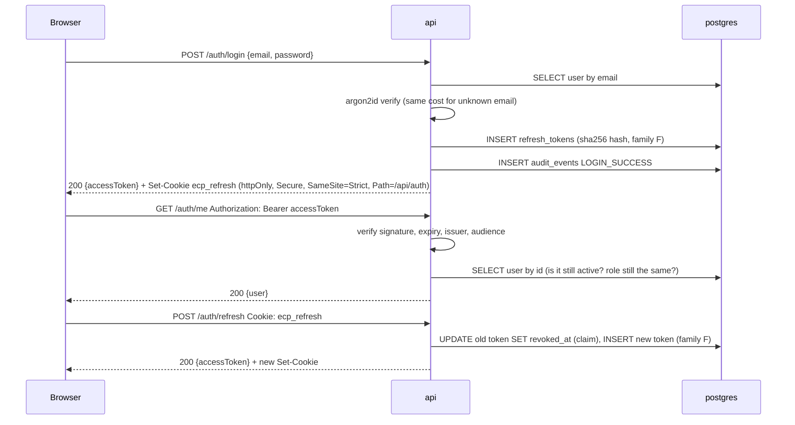

# Authentication and authorisation

Phase 3. Status: **RUNS LOCALLY** and **TESTED** (see [progress.md](progress.md) for the test counts and the machine they ran on). Each component below answers the six questions from Section 15 of the spec.

## The flow in one paragraph

A user registers with an email and a password. The password is hashed with argon2id and only the hash is stored. On login the API returns two things: a short-lived **access token** (a JWT, 15 minutes) in the JSON body, and a long-lived **refresh token** (7 days) in an httpOnly cookie. The browser sends the access token as a bearer header on every API call. When it expires, the browser calls `/auth/refresh`; the cookie is exchanged for a new access token and a **new** refresh token, and the old refresh token is marked used. If an old refresh token is ever presented again, every token from that login is revoked. Every one of these events is written to an append-only audit table.

## Password hashing: argon2id

- **What**: a slow, memory-hard hash function. The API stores `argon2id(password, random salt)` and never the password.
- **Why**: databases leak. A leaked table of argon2id hashes costs an attacker about 19 MiB of RAM and several milliseconds per guess, per password. A leaked table of SHA-256 hashes falls to a GPU at billions of guesses per second.
- **How**: `@node-rs/argon2` with the OWASP minimum parameters (19 MiB, 2 iterations, 1 lane). Verification is constant-time. When the email does not exist the API still verifies against a dummy hash so the response takes the same time either way; otherwise an attacker could learn which emails have accounts by timing the failures.
- **Why chosen**: argon2id won the Password Hashing Competition and is the current OWASP first choice. bcrypt would also have been acceptable; argon2id resists GPU and side-channel attacks better.
- **Without it**: one SQL injection or one stolen backup exposes every user's real password, which most people reuse elsewhere.
- **Real companies**: exactly this, plus a "rehash on login" step when parameters are raised over time.

## Access tokens: short-lived JWTs

- **What**: a JSON Web Token signed with HMAC-SHA256 using one server secret. It carries the user ID, the role, an issuer, an audience and a 15-minute expiry.
- **Why**: the API is stateless, so any instance behind the load balancer can verify a request without a shared session store. The short life bounds the damage of a stolen token.
- **How**: `Authorization: Bearer <token>`. The `requireAuth` middleware verifies the signature and claims, then re-reads the user row. That extra query is deliberate: deactivation and role changes take effect on the next request, not in 15 minutes (requirement A3).
- **Why chosen**: JWTs are the standard for stateless APIs. HS256 is enough for one API; RS256/EdDSA matter when other services must verify tokens without the secret.
- **Without it**: every request would need a database lookup of a session ID, and the API could not scale horizontally without sticky sessions or a session store.
- **Real companies**: the same shape, often with a central identity provider (Cognito, Auth0, Entra ID) issuing the tokens and the API only verifying them.

## Refresh tokens: rotation with reuse detection

- **What**: an opaque 256-bit random string in an httpOnly cookie. The database stores its SHA-256 hash, the user, an expiry, the time it was revoked, and a **family ID** shared by every token descended from the same login.
- **Why**: a 15-minute access token would log users out every 15 minutes. The refresh token extends the session without extending the exposure of the access token.
- **How**: every refresh **rotates**: the presented token is claimed (marked revoked in one atomic update) and a successor in the same family is issued. If a revoked token is presented again, someone holds a stale copy, and there is no way to tell whether it is the real client or a thief. So the whole family is revoked and both parties must log in again (requirement B4). Logout revokes the token; deactivating a user revokes all of theirs.
- **Cookie flags**: `httpOnly` (JavaScript cannot read it, so XSS cannot steal it), `Secure` (HTTPS only; browsers treat localhost as secure), `SameSite=Strict` (never sent from another site, which defeats CSRF), `Path=/api/auth` (only sent to the auth routes, never with ordinary API calls).
- **Why chosen**: rotation with family revocation is the OAuth 2.1 recommendation for browser clients.
- **Without it**: a stolen refresh token would be valid for its full 7 days with nobody the wiser.
- **Real companies**: the same. Some also bind the token to a device fingerprint or IP range.

## Role-based access control

- **What**: each user has a role, `user` or `admin`, stored as a PostgreSQL enum on the user row. `requireRole('admin')` guards the `/admin/*` routes.
- **Why**: administrators manage accounts; users manage their own documents. Requirement B2 says non-admins are blocked from all admin routes.
- **How**: `requireAuth` runs first and loads the current role from the database, then `requireRole` compares. The role inside the JWT is never trusted for authorisation; it is only a hint for the UI.
- **Guard rails**: an admin cannot change their own role or deactivate themselves. A lone admin locking everyone out is a classic self-inflicted outage.
- **Why chosen**: two roles do not justify a roles table and a join table. Moving to one later is a single migration (decision D9).
- **Without it**: any logged-in user could list, promote or deactivate anyone.
- **Real companies**: RBAC for coarse permissions, often with attribute-based rules (ABAC) or a policy engine on top for fine-grained ones.

## Audit trail

- **What**: `audit_events` records who did what, to which target, from which IP and user agent, when, and whether it succeeded. Registration, login success and failure, logout, refresh failures and reuse detection, role changes and deactivations are recorded now; document actions join in Phase 4.
- **Why**: after an incident the first question is "what happened and who did it". Without a trail the answer is a guess.
- **How**: a row is inserted inside the request; if the insert fails the request fails, because an action without a trail is worse than a failed action. A database trigger rejects every `UPDATE` and `DELETE` on the table, so even the application's own credentials cannot rewrite history (requirement L4). Passwords, tokens and file contents are never written.
- **Why chosen**: a trigger travels with the migration and works on any PostgreSQL, including RDS. Phase 5 adds a second layer by connecting as a role without UPDATE/DELETE grants.
- **Without it**: no way to answer an auditor, a customer or a court.
- **Real companies**: the same table, shipped to an immutable log store (CloudWatch Logs, an S3 bucket with Object Lock, or a SIEM) so it survives even a database compromise.

## Rate limiting and input validation

- **Rate limiting**: `/auth/login`, `/auth/register` and `/auth/refresh` allow 10 attempts per IP per 15 minutes, then answer 429 with standard `RateLimit` headers. This slows credential stuffing and bounds how fast the 409 on duplicate registration can be used to probe which emails have accounts. The limit is in memory per API instance; Phase 5 notes when a shared store would be needed.
- **Validation**: every body is parsed with the Zod schemas in `packages/shared`, the same schemas the frontend uses. Emails are trimmed and lower-cased before they reach the database. Error details name the field but never echo the rejected value.
- **Trust proxy**: `TRUST_PROXY` says how many reverse proxies stand in front of the API. Set too high, a client can spoof its IP with an `X-Forwarded-For` header and dodge the rate limiter; set too low, every client behind the proxy shares one limit.

## Endpoints

| Method and path | Auth | Purpose | Failure codes |
|---|---|---|---|
| `POST /auth/register` | none | create a user | `VALIDATION_ERROR`, `EMAIL_TAKEN`, `RATE_LIMITED` |
| `POST /auth/login` | none | issue tokens | `INVALID_CREDENTIALS`, `ACCOUNT_DEACTIVATED`, `RATE_LIMITED` |
| `POST /auth/refresh` | cookie | rotate tokens | `UNAUTHORIZED`, `ACCOUNT_DEACTIVATED`, `RATE_LIMITED` |
| `POST /auth/logout` | cookie | revoke the refresh token | none (always 204) |
| `GET /auth/me` | bearer | current user | `UNAUTHORIZED`, `ACCOUNT_DEACTIVATED` |
| `GET /admin/users` | admin | list users | `UNAUTHORIZED`, `FORBIDDEN` |
| `PATCH /admin/users/:id/role` | admin | change a role | `CANNOT_CHANGE_OWN_ROLE`, `USER_NOT_FOUND`, `VALIDATION_ERROR` |
| `POST /admin/users/:id/deactivate` | admin | deactivate a user | `CANNOT_DEACTIVATE_SELF`, `USER_NOT_FOUND` |
| `GET /health` | none | liveness | never fails |
| `GET /ready` | none | readiness (database) | 503 with `checks.database = failed` |

Through the Vite proxy or nginx the browser sees these under `/api/`, for example `/api/auth/login`.

## Known trade-offs

- A duplicate registration returns 409, which confirms that an email has an account. The rate limiter bounds the probing speed. The alternative, always answering 201 and emailing the real owner, needs an email service the project does not have.
- The rate limiter is per process. Two API containers would each allow 10 attempts. Acceptable locally; the AWS design puts the WAF rate rule in front.
- A benign race (two browser tabs refreshing at the same instant) is treated as reuse and logs both out. Strict is the safer default.
