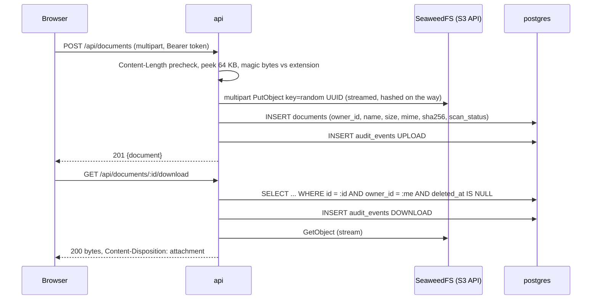

# Documents and object storage

Phase 4. Status: **RUNS LOCALLY** and **TESTED**; SeaweedFS is **SIMULATED** (a stand-in for Amazon S3). See [progress.md](progress.md) for the test counts and the machine they ran on. Each component below answers the six questions from Section 15 of the spec.

## The flow in one paragraph

A logged-in user uploads a file with a multipart request. The API reads the first 64 KB, checks that the bytes match the extension against an allow-list, and only then streams the rest straight into object storage under a random key while hashing it. A metadata row (owner, name, size, proven MIME type, SHA-256, scan status) goes into PostgreSQL. Every later query for that document includes the owner's ID in the `WHERE` clause, so another user gets a 404 whether they guess the ID or not. Downloads are streamed back through the API after that check, and every upload, download and delete is written to the audit table.

## Object storage: SeaweedFS behind the S3 API

- **What**: a separate service that stores file bytes under keys, reached over the S3 protocol. Locally it is SeaweedFS `mini` in Docker; in AWS it would be S3 itself with the same SDK calls.
- **Why**: files do not belong in a relational database (bloat, backups, memory) or on a container's disk (lost when the container is replaced, invisible to a second replica).
- **How**: the AWS SDK for JavaScript v3 with a custom endpoint and path-style URLs. Uploads use the SDK's multipart uploader driven by a stream, so a 25 MB file never sits in memory. The bucket is private; browsers never talk to storage.
- **Why chosen**: SeaweedFS is maintained, Apache 2.0, one process and light on RAM ([environment.md](environment.md) records why MinIO was rejected). Pinned to 4.47 in `compose.yaml`.
- **Without it**: no durable place for bytes, and no path to S3 later without rewriting the upload code.
- **Real companies**: S3 with public access blocked, server-side encryption, versioning, lifecycle rules, reached from private subnets through a VPC endpoint, with the task role instead of static keys.

## Upload validation (requirement B5)

- **What**: a file is accepted only if its extension is on the allow-list **and** its bytes prove that type.
- **Why**: the extension and the `Content-Type` header are claims the client makes. Malware is routinely renamed `invoice.pdf`. Browsers and other users' software act on what a file *is*.
- **How**: the first 64 KB are inspected with `file-type` (magic-byte signatures; 64 KB because Office files carry their signature inside a zip directory). Binary types must match exactly. Text types (`txt`, `csv`, `md`) have no signature, so they must carry no binary signature, contain no NUL or control bytes and decode as UTF-8. The stored MIME type is what the bytes proved, never what the client sent. Size is enforced twice: a `Content-Length` precheck answers 413 before reading, and the multipart parser's hard limit truncates anything that sneaks past, after which the partial object is deleted.
- **Sanitised names**: directories, control characters and shell-hostile characters are stripped; the extension is lower-cased; the length is capped. The name is display-only; it is never used as a storage key or path.
- **Random storage keys**: a UUID per object. A key cannot be guessed from a filename, an owner or a sequence.
- **Checksum**: SHA-256 computed while streaming, stored with the metadata, so integrity can be verified after a restore (Phase 12).
- **Without it**: users could upload executables disguised as documents and serve them to each other.
- **Real companies**: the same checks, plus antivirus (Phase 7 here) and often image re-encoding to strip embedded payloads.

## Ownership enforcement (requirements U10, B1)

- **What**: every document query includes `owner_id = current user` and `deleted_at IS NULL`.
- **Why**: the core boundary of the whole platform. User A must never see user B's files, including by guessing IDs.
- **How**: routes never touch the `documents` table directly. They call functions in `apps/api/src/lib/documents.ts` that all take the owner ID, so a forgotten check in one handler cannot leak data. A malformed ID, an unknown ID and someone else's ID all answer the same 404 (decision D8), so nothing can be learned from the response.
- **Without it**: an incrementing or leaked ID would expose every file on the platform.
- **Real companies**: the same rule, often generalised as row-level security in the database as a second layer.

## Download: streamed through the API (decision D2)

- **What**: `GET /documents/:id/download` streams the object from storage to the client with `Content-Disposition: attachment`, the proven MIME type and `Cache-Control: private, no-store`.
- **Why streamed and not a pre-signed URL**: a pre-signed URL is a bearer credential for its lifetime, bypasses the audit log unless extra plumbing is added, and locally the browser cannot resolve the storage container's hostname. Streaming keeps auth, ownership, scan status and audit on one path. The cost is that the API is the bandwidth bottleneck, fine at this scale; [scalability.md](scalability.md) (Phase 13) documents pre-signed URLs as the upgrade.
- **Scan status**: `PENDING_SCAN` answers 409, `QUARANTINED` answers 403. With `MALWARE_SCAN=off` (the default until Phase 7) uploads are marked `CLEAN` at once and the audit row says so.

## Folders, tags, search and soft delete (U5, U7, U8, U9)

- Folders are flat, one level, unique by name per owner. Deleting a folder un-files its documents (the foreign key is `SET NULL`); nothing is lost.
- Tags are created on demand when set on a document, scoped to the owner, and deleted explicitly. Two users can each have a tag called `tax`.
- Listing supports a case-insensitive name search, folder (`root` for unfiled), tag and scan-status filters, and paging (max 100 per page).
- Delete is soft: `deleted_at` is set, the row and the object stay for recovery, and the document vanishes from every route. A purge job for old soft-deleted objects belongs to Phase 12 with backups.

## Endpoints

All require a bearer token. `:id` must be a UUID; anything else is a 404.

| Method and path | Purpose | Failure codes |
|---|---|---|
| `POST /documents?folderId=` | upload one file (multipart field `file`) | `FILE_REQUIRED`, `ONE_FILE_ONLY`, `TYPE_NOT_ALLOWED`, `TYPE_MISMATCH` (415), `FILE_TOO_LARGE` (413), `FOLDER_NOT_FOUND` |
| `GET /documents?q=&folderId=&tag=&scanStatus=&page=&pageSize=` | list and search own documents | `VALIDATION_ERROR` |
| `GET /documents/:id` | metadata | `DOCUMENT_NOT_FOUND` |
| `PATCH /documents/:id` | rename, move, set tags | `DOCUMENT_NOT_FOUND`, `FOLDER_NOT_FOUND`, `VALIDATION_ERROR` |
| `DELETE /documents/:id` | soft delete | `DOCUMENT_NOT_FOUND` |
| `GET /documents/:id/download` | stream the bytes | `DOCUMENT_NOT_FOUND`, `SCAN_PENDING` (409), `FILE_QUARANTINED` (403) |
| `GET`, `POST /folders`; `PATCH`, `DELETE /folders/:id` | folders | `FOLDER_EXISTS` (409), `FOLDER_NOT_FOUND` |
| `GET /tags`; `DELETE /tags/:id` | tags with live document counts | `TAG_NOT_FOUND` |
| `GET /ready` | now checks storage as well as the database | 503 with `checks.storage = failed` |

Allowed uploads: `pdf png jpg jpeg gif webp docx xlsx pptx txt csv md`, up to `UPLOAD_MAX_BYTES` (25 MiB by default). The list lives in `packages/shared` so the frontend can pre-filter with the same rule.

## Known trade-offs

- Text detection is a heuristic (UTF-8, no control bytes). A carefully crafted text file can still contain, say, an HTML payload; it is served as `text/plain` with `nosniff`, which browsers honour, and it never executes on the server.
- Office formats are detected as the right container type, but the detector cannot see macros. That is the malware scanner's job (Phase 7).
- The storage credentials are one static admin key pair, which is what SeaweedFS `mini` supports out of the box. The AWS design replaces them with the task role.
- Deleting a document does not yet delete the object; a purge job with a retention window arrives with backups in Phase 12.
